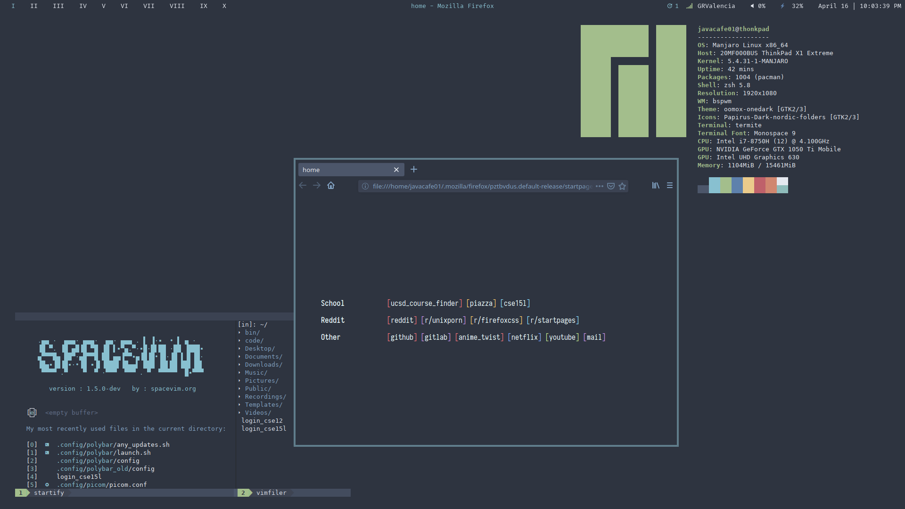

# Gokul's Dotfiles

**OS**       : Manjaro

**WM**       : Bspwm

**Terminal** : Termite

**Browser**  : Firefox

**Vim**      : SpaceVim
 
### Firefox
The actual theme of firefox is something I grabbed from  and modified. 

### Rofi
My rofi config is from . I slightly modified the material colorscheme, the font, and added a border.

### Vim
I use the nord color scheme of 

